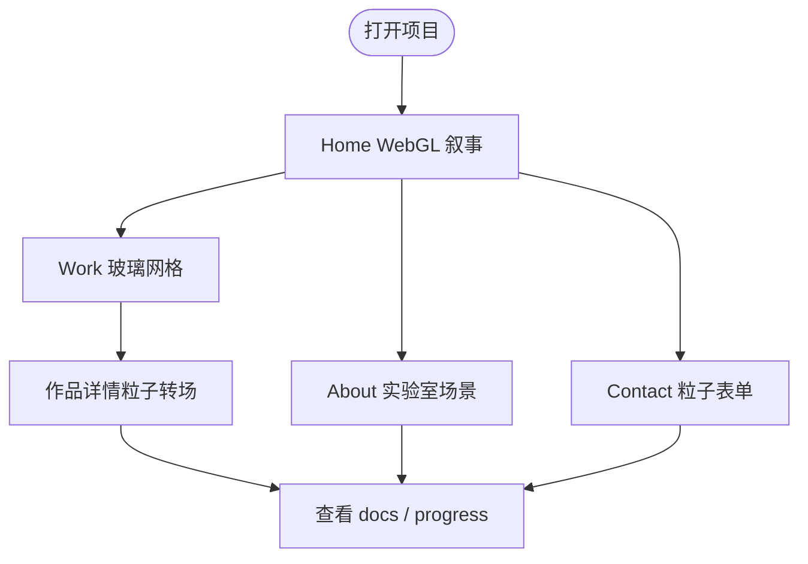

# Active Theory WebGL 学习项目

> 一个面向 WebGL 学习的复刻实验：用 Next.js、React Three Fiber、Three.js 和自定义 shader 研究 Active Theory 风格的沉浸式网页、粒子转场、玻璃材质和持久 Canvas 路由体验。

## 它能做什么

- **沉浸式首页**：用多阶段滚动叙事呈现 ring、particle shower、workshop、spiral 等 WebGL 场景。
- **Work 作品网格**：玻璃方块、hover 形变、环境反射和滚动推进。
- **路由粒子转场**：从作品方块采样粒子，过渡到详情页 hero。
- **About / Contact 场景**：SDF logo、线框实验室、粒子联系表单。
- **持久 Canvas**：切换页面时保留 WebGL runtime，减少重新挂载。
- **学习记录**：用 docs 和 progress 文件记录每个阶段的实现思路和验证状态。

## 学习流程



## 快速开始

```bash
npm install
npm run dev -- -p 3100
```

然后打开：

```text
http://localhost:3100
```

如果 Turbopack 在本机 WebGL/R3F 开发时内存压力较高，可以切到 Webpack：

```bash
npm run dev -- --webpack -p 3100
```

## 常用命令

```bash
npm run dev       # 启动开发服务
npm run build     # 生产构建
npm run start     # 启动生产服务
npm run lint      # ESLint
npm run assets:fetch
```

## 技术栈

- Next.js 16 + React 19
- TypeScript strict
- Three.js + React Three Fiber + drei
- postprocessing
- GSAP / Lenis / Howler
- Zustand
- Tailwind CSS v4
- 自定义 GLSL shader

## 已实现 Shader

| Shader | 位置 | 用途 |
|---|---|---|
| `HomeRingShader` | `components/scenes/home/shaders/homeRing.ts` | 首页虹彩环形结构 |
| `HomeParticleShader` | `components/scenes/home/shaders/homeParticle.ts` | DPR 感知粒子、光标漂移、深度缩放 |
| `WorkBackgroundShader` | `components/scenes/work/shaders/workBackground.ts` | Work 背景噪声渐变 |
| `WorkGlassCubeShader` | `components/scenes/work/shaders/workGlassCube.ts` | 玻璃方块 hover 材质 |
| `WorkDetailDissolveShader` | `components/scenes/workDetail/shaders/dissolve.ts` | 详情页粒子溶解转场 |
| `AboutLogoShader` | `components/scenes/about/shaders/aboutLogo.ts` | SDF logo 发光 |
| `AboutLabLogoShader` | `components/scenes/about/shaders/aboutLabLogo.ts` | 线框实验室 logo |

## 文件结构

```text
xuexi-xiangmu/
├── app/                         # Next.js routes
├── components/
│   ├── dom/                     # DOM UI
│   ├── fx/                      # 后处理
│   ├── rig/                     # camera/cursor rig
│   ├── scenes/                  # WebGL 场景
│   └── webgl/                   # Canvas provider/router
├── data/                        # 项目数据和 MDX 内容
├── docs/                        # 阶段文档
├── lib/                         # store、palette、scene params
├── public/                      # 静态资源占位
├── shaders/                     # GLSL 源文件
├── scripts/
├── progress.md
└── README.md
```

## 已知限制

- 这是学习复刻项目，不包含 Active Theory 的闭源 Hydra 引擎。
- 视觉资源多为占位或重新生成素材，不直接使用原站私有资产。
- 高强度 WebGL 场景对移动端和低端设备压力较大。
- 部分阶段仍处于视觉 QA / 多视口校验中。

## 参考

- Active Theory Hydra Medium article
- Active Theory 公开站点交互观察
- Three.js / R3F / postprocessing 文档
